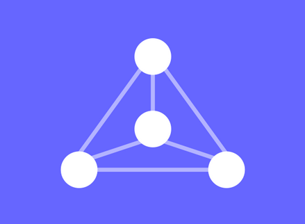

# DataStructures

## Description
The goal of this project is to learn how to code in C++ by practicing with basic data structures. I'll try my best to write clean and readable code, as this repo will be used by my other projects as a common library. To achieve that, I will try as much as I can to follow the guidelines given in the [C++ Core Guidelines](https://isocpp.github.io/CppCoreGuidelines/CppCoreGuidelines) and the [Google C++ Style Guide](https://google.github.io/styleguide/cppguide.html).

## Project status
Project is ongoing !

## Installation
You will need clang to compile, Google Test to test, and Doxygen to generate the documentation

## Support
I doubt anyone will need this project for anything, or will even read this README. But if you do, don't hesitate to contact me directly on any platform.

## Contributing
The point of this project is that I have to code those structures alone, to improve my C++ abilities. But if you happen to find a bug  (And there will probably be a lot of them), please don't hesitate to contact me so that I can fix it.

## Roadmap
I plan to implement graphs, trees, and other basic data structures.
When I'm done with all of that, maybe I'll consider making visual representations of those structures, not really sure how for now.

## Usage
Coming soon...

## Visuals
As said in the Roadmap, I plan to add visualization to those data structures in the future. Something like [that](https://visualgo.net).

## Authors and acknowledgment
I would like to give a special thank you to Olivier Festor and Pierre Ludmann for their courses on data structures and algorithms, which have been my primary resources for this project.

## Other
Regarding AI use, this project will NOT be vibe coded, as it would become useless as a practicing tool. AI may be used as a documentation tool, but coding and debugging will be done as much as possible by hand.